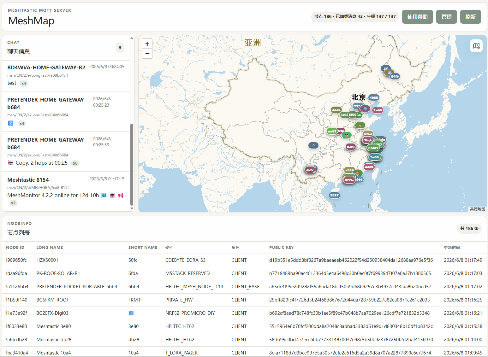

# Meshtastic MQTT Server

Meshtastic MQTT Server 是一个面向 Meshtastic MQTT 数据的本地服务：内置 MQTT broker，接收并校验 Meshtastic MQTT payload，同时提供 Web 管理与地图前端，用于查看节点、消息、位置、遥测、转发状态和管理配置。



## 后端功能

后端提供 MQTT broker、Meshtastic 数据校验、数据入库、Web API 和管理后台能力，主要功能包括：


- 用户管理：支持创建管理员用户、修改管理员密码。
- 屏蔽规则管理：支持设置节点屏蔽、IP 屏蔽和屏蔽词；屏蔽词可设置匹配方式、是否区分大小写、启用状态和原因。
- 消息拦截：命中被屏蔽节点、被屏蔽 IP 或屏蔽词的消息会被拒绝，并写入丢弃记录。
- MQTT 转发管理：支持配置多个 MQTT 转发器，设置源端、目标端、TLS、认证信息、转发 topic、方向、QoS、retain，并可查看转发运行状态或重启转发器。
- 运行时设置：支持动态设置无法解密的加密 MQTT 包是否允许继续转发。
- 地图源管理：支持配置地图瓦片源、默认地图源、启用状态、最大缩放级别、attribution 和是否通过后端代理地图瓦片。
- 地图瓦片代理与缓存：可通过后端代理地图瓦片请求，并使用本地目录缓存。
- 帮助内容管理：支持在管理后台编辑 Markdown 帮助内容，并提供预览与展示。
- 数据库支持：支持 SQLite 和 MySQL。
- Meshtastic payload 校验：在消息转发前校验 Meshtastic MQTT 数据包，无效数据会被拒绝并记录。
- 数据解析与存储：解析并保存节点信息、地图上报、文本消息、位置、遥测、路由、traceroute 等数据。


## 运行环境

### 后端

- Go：`1.25.0` 或更高版本
- 默认监听：
  - MQTT：`0.0.0.0:1883`
  - Web：`0.0.0.0:8080`

### 前端

- Node.js：满足 Vite 8 要求
  - `^20.19.0`，或
  - `>=22.12.0`
- npm：随 Node.js 安装即可

建议生产环境使用当前 LTS 版本的 Node.js，并确保版本满足上述要求。

## 快速部署

### Linux 一键部署

在 Linux 下进入项目目录后，直接执行：

```bash
sudo bash install.sh
```

安装脚本会自动拉取最新代码、安装前端依赖、构建前端、编译后端、安装到 `/opt/mesh_mqtt_go`，并创建和启动 `mesh_mqtt_go` systemd 服务。

### 手动构建前端

```bash
cd meshmap_frontend
npm install
npm run build
cd ..
```

构建完成后，前端静态文件会生成到项目根目录的 `dist`，也就是从 `meshmap_frontend` 目录看是 `../dist`。

### 手动构建后端

```bash
go build -o meshtastic_mqtt_server .
```

### 手动启动

```bash
./meshtastic_mqtt_server -web-static-dir ./dist
```

首次启动时，程序会自动生成默认配置文件。

默认配置路径：

- Linux：`/etc/mesh_mqtt_go/config.yaml`
- Windows：`./win/etc/mesh_mqtt_go/config.yaml`

默认数据路径：

- Linux SQLite：`/srv/mesh_mqtt_go/mesh_mqtt_go.db`
- Windows SQLite：`./win/etc/mesh_mqtt_go/mesh_mqtt_go.db`

默认地图瓦片缓存目录：

- Linux：`/srv/mesh_mqtt_go`
- Windows：`./win/srv/mesh_mqtt_go`

## 常用启动参数

```bash
./meshtastic_mqtt_server \
  -host 0.0.0.0 \
  -port 1883 \
  -web-host 0.0.0.0 \
  -web-port 8080 \
  -web-static-dir ./dist
```

常用参数说明：

| 参数 | 说明 | 默认值 |
| --- | --- | --- |
| `-host` | MQTT broker 监听地址 | `0.0.0.0` |
| `-port` | MQTT broker 监听端口 | `1883` |
| `-psk` | Meshtastic channel PSK，Base64 格式 | `AQ==` |
| `-tls` | 启用 MQTT TLS | `false` |
| `-tls-cert` | MQTT TLS 证书文件 | 空 |
| `-tls-key` | MQTT TLS 私钥文件 | 空 |
| `-db-driver` | 数据库类型：`sqlite` 或 `mysql` | `sqlite` |
| `-sqlite-path` | SQLite 数据库文件路径 | 见默认数据路径 |
| `-mysql-dsn` | MySQL DSN | 空 |
| `-web` | 启用 Web 服务 | `true` |
| `-web-host` | Web 服务监听地址 | `0.0.0.0` |
| `-web-port` | Web 服务监听端口 | `8080` |
| `-web-socket-path` | Web Unix Socket 路径，Windows 不支持 | Linux 默认 `/opt/mesh_mqtt_go/web.sock` |
| `-web-static-dir` | 前端静态文件目录 | `./dist` |
| `-web-map-tile-cache-dir` | 地图瓦片缓存目录 | 见默认地图瓦片缓存目录 |
| `-admin-username` | Web 管理员用户名 | `admin` |

管理员密码与会话密钥建议通过环境变量传入：

```bash
export MESH_ADMIN_PASSWORD='change-me'
export MESH_ADMIN_SESSION_SECRET='replace-with-a-long-random-string'
./meshtastic_mqtt_server
```

## 配置文件示例

程序会自动生成并补全配置文件，也可以手动维护 `config.yaml`：

```yaml
mqtt:
  host: 0.0.0.0
  port: 1883
  tls:
    enabled: false
    cert_file: ""
    key_file: ""

meshtastic:
  psk: AQ==

database:
  driver: sqlite
  sqlite:
    path: /srv/mesh_mqtt_go/mesh_mqtt_go.db
  mysql:
    dsn: ""

web:
  enabled: true
  host: 0.0.0.0
  port: 8080
  socket_path: ""
  static_dir: ./dist
  map_tile_cache_dir: /srv/mesh_mqtt_go
  admin:
    username: admin
    password: admin
    session_secret: ""
    session_secure: false
```

> 生产环境请修改默认管理员密码，并设置足够长、随机的 `session_secret`。如果通过 HTTPS 访问 Web 管理后台，建议将 `session_secure` 设置为 `true`。

## 使用 SQLite 部署

SQLite 是默认数据库，适合单机部署：

```bash
mkdir -p /srv/mesh_mqtt_go
./meshtastic_mqtt_server \
  -db-driver sqlite \
  -sqlite-path /srv/mesh_mqtt_go/mesh_mqtt_go.db \
  -web-map-tile-cache-dir /srv/mesh_mqtt_go
```

## 使用 MySQL 部署

如果需要使用 MySQL，启动时指定数据库驱动和 DSN：

```bash
./meshtastic_mqtt_server \
  -db-driver mysql \
  -mysql-dsn 'user:password@tcp(127.0.0.1:3306)/meshtastic?charset=utf8mb4&parseTime=True&loc=Local'
```

## 启用 MQTT TLS

准备证书和私钥后启动：

```bash
./meshtastic_mqtt_server \
  -tls \
  -tls-cert /path/to/server.crt \
  -tls-key /path/to/server.key
```

## 访问服务

启动后可访问：

- Web 前端：`http://服务器地址:8080/`
- 健康检查：`http://服务器地址:8080/api/health`
- MQTT broker：`服务器地址:1883`

Web 管理后台默认账号：

- 用户名：`admin`
- 密码：`admin`

生产环境请务必修改默认密码。

## systemd 部署示例

以下示例假设：

- 后端可执行文件位于 `/opt/mesh_mqtt_go/meshtastic_mqtt_server`
- 前端静态文件位于 `/opt/mesh_mqtt_go/dist`
- 数据与缓存目录位于 `/srv/mesh_mqtt_go`
- 配置文件位于 `/etc/mesh_mqtt_go/config.yaml`

创建服务文件 `/etc/systemd/system/mesh_mqtt_go.service`：

```ini
[Unit]
Description=Meshtastic MQTT Server
After=network.target

[Service]
Type=simple
WorkingDirectory=/opt/mesh_mqtt_go
ExecStart=/opt/mesh_mqtt_go/meshtastic_mqtt_server -web-static-dir /opt/mesh_mqtt_go/dist
Environment=MESH_ADMIN_PASSWORD=change-me
Environment=MESH_ADMIN_SESSION_SECRET=replace-with-a-long-random-string
Restart=on-failure
RestartSec=5s

[Install]
WantedBy=multi-user.target
```

启用并启动服务：

```bash
sudo systemctl daemon-reload
sudo systemctl enable --now mesh_mqtt_go
sudo systemctl status mesh_mqtt_go
```

查看日志：

```bash
sudo journalctl -u mesh_mqtt_go -f
```

## 生产环境建议

- 修改默认管理员密码。
- 设置随机且足够长的 `MESH_ADMIN_SESSION_SECRET`。
- 使用反向代理提供 HTTPS。
- 如果 Web 管理后台通过 HTTPS 访问，启用安全 Cookie。
- 根据实际情况开放防火墙端口：
  - MQTT：`1883`
  - MQTT TLS：自定义端口或仍使用 `1883`
  - Web：`8080` 或反向代理端口
- 定期备份数据库文件或 MySQL 数据库。
- 为地图瓦片缓存目录预留足够磁盘空间。

## 开源协议

本项目采用 MIT License 开源。详见项目许可证文件。